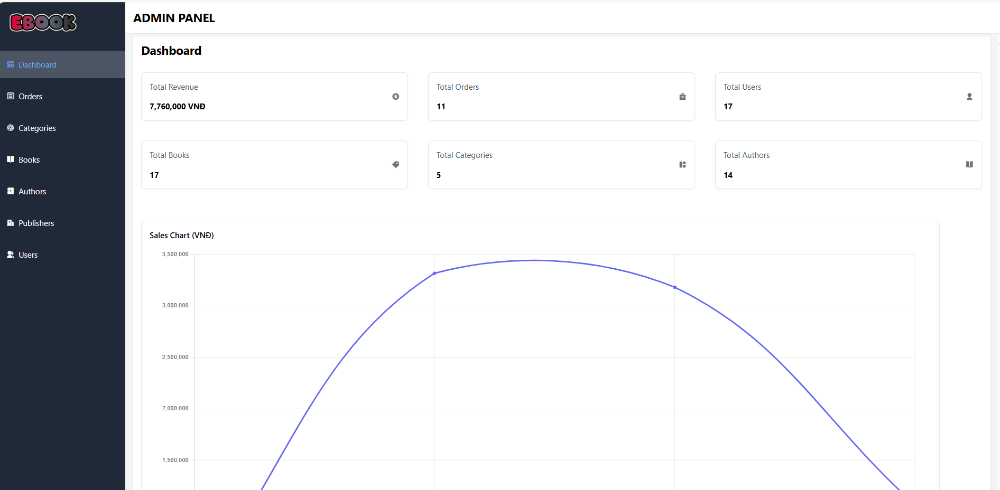
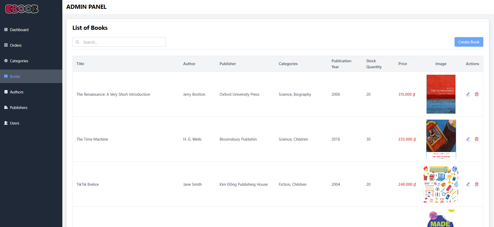
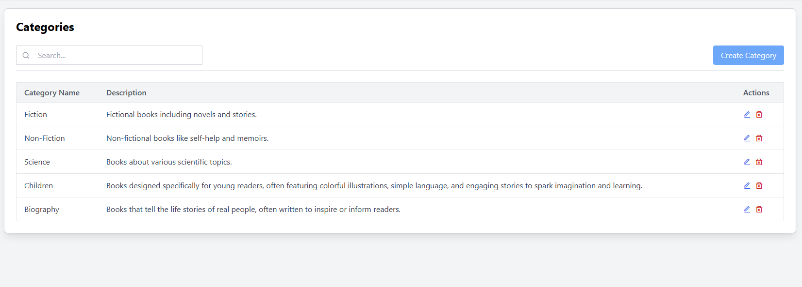
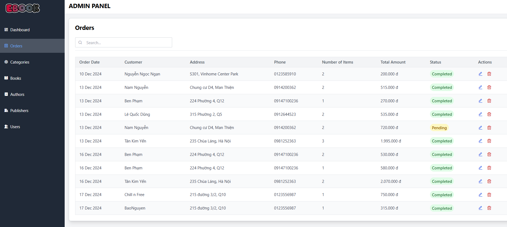
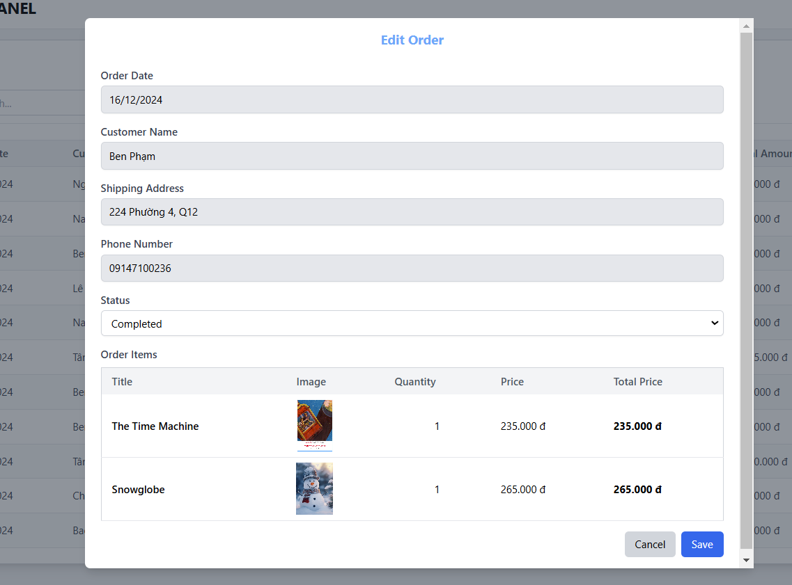

# eBook (Website for Admin)
A comprehensive management system for the eBook online store, enabling administrators to effectively manage the platform, monitor operations, and maintain the bookstore.

## Features

- Dashboard & Analytics
- Book Management
- Category Management
- Publisher Management
- Author Management
- User Management
- Order Management

## Requirement
- Development environment:
    - .NET 8.0+
    - React.js 18.2.0+ for frontend development.
    - Visual Studio 2022 or VS Code
    - Tailwind CSS for styling.
    - SQL Server 2019+ for database
      
## Installation Guide

To install and run the project locally, follow these steps:

1. Clone this repo.
2. Run `npm install` to install the dependencies.
3. Run `npm start` to start the server.

## User Interface

## Authors

[Lê Quốc Dũng](https://github.com/DungLe2983)

[Phạm Thanh Đồng ](https://github.com/ThanhDong00)

